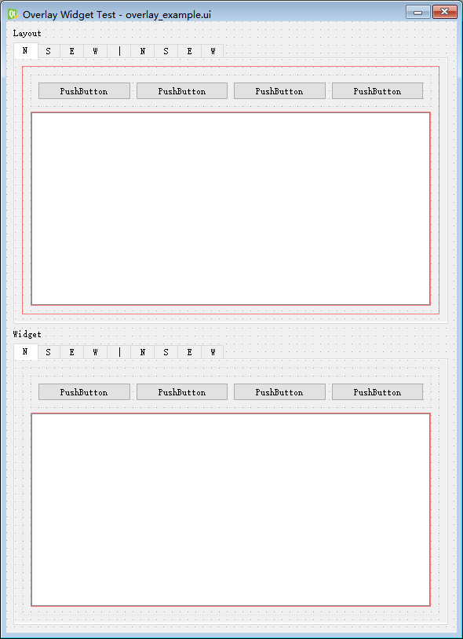
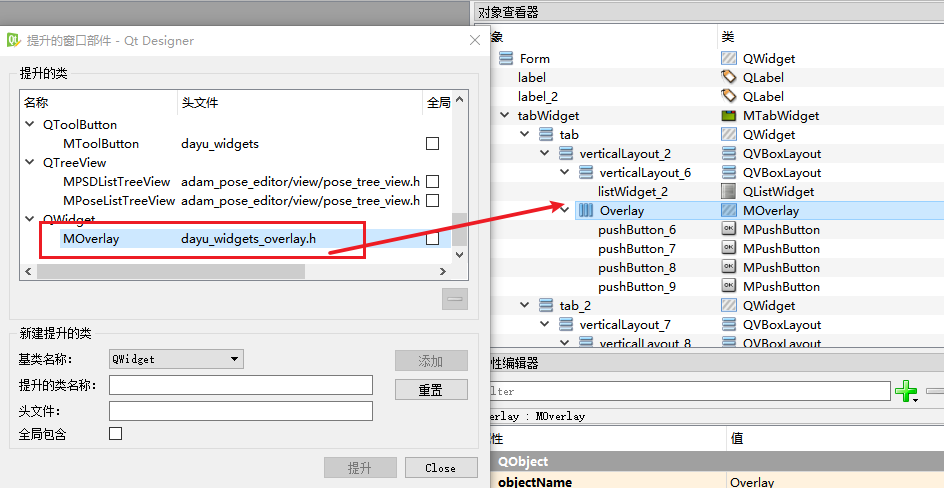
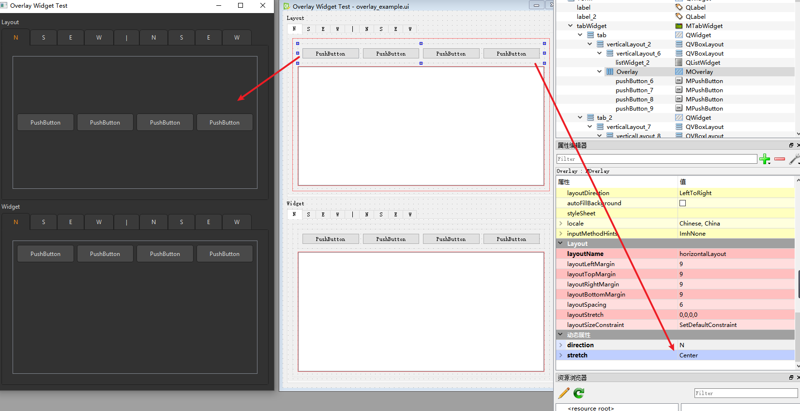

# dayu_widgets_overlay

[](https://results.pre-commit.ci/latest/github/FXTD-ODYSSEY/dauy_widgets_overlay/master)
[](https://img.shields.io/pypi/pyversions/dauy_widgets_overlay)
[](https://badge.fury.io/py/dauy_widgets_overlay)
[](https://dauy_widgets_overlay.readthedocs.io/en/master/?badge=master)


[](https://pepy.tech/badge/dauy_widgets_overlay)
[](https://github.com/loonghao/dauy_widgets_overlay/graphs/commit-activity)


Python Qt Overlay Widget as a [dayu_widgets](https://github.com/phenom-films/dayu_widgets) plugin

## How it work




overlay the widget onto the other widget and resize together
much easy to add and maintain instead of create a New type of widget.

## How to use

```cmd
pip install dayu-widgets-overlay
```

```Python
from dayu_widgets_overlay import MOverlay
```

In Qt Designer, you can extend a QWidget into MOverlay



## QtDesigner Property

`direction` : `E` `S` `W` `N`

`stretch` (optional - default: Auto) : `NoStretch` `Vertical` `Horizontal` `Center` `Auto`



---

See my blog article for more details in chinese

https://blog.l0v0.com/posts/1ba28015.html
